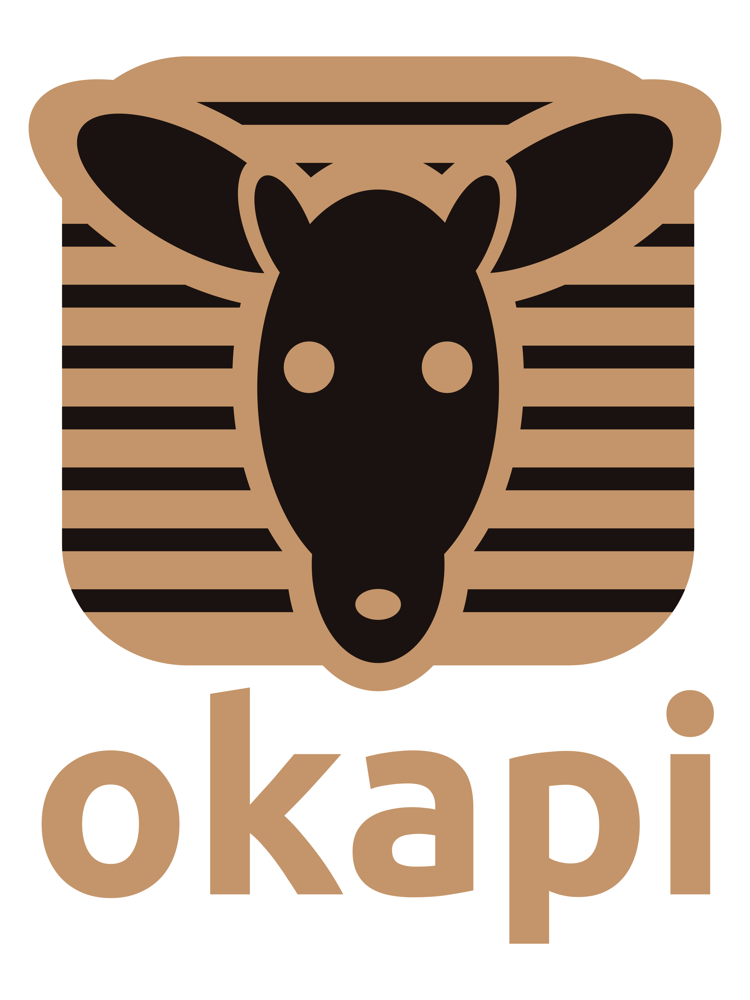
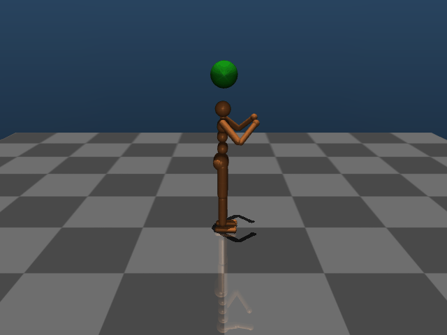

# okapi: Deep Reinforcement Learning with JAX Flax NNX and MuJoCo Playground
<a></a>

This repository provides high-performing implementation of PPO for JAX Flax NNX and MuJoCo Playground. The implementation is a partial adaptation of Brax PPO. However, unlike `Brax` it uses simple single-file implementations and the more readable Flax NNX API instead of Flax Linen.

**Features:**
- Single-file implementation of DRL baselines with Flax NNX.
- Physics simulation, neural network inference and gradient computation all runs on GPU with `jit`-acceleration.
- Compatible with MuJoCo Playground environments - supporting [MuJoCo MJX](https://mujoco.readthedocs.io/en/stable/mjx.html) and [Warp](https://mujoco.readthedocs.io/en/stable/mjwarp/index.html).
- Checkpointing with [orbax-checkpoint](https://orbax.readthedocs.io/)
- Config management with [hydra](https://hydra.cc)
- Experiment logging via [wandb](https://wandb.ai/)
- Dependency management with [uv](https://docs.astral.sh/uv/) 

**Disclaimer 1:** This repository is not actively developed framework and will not provide any further support or documentation. It is intended for hobbyists and as a look-up for the usage of Flax NNX in DRL. For reliable and widely-validated and tested results, we recommend more mature frameworks e.g. [stable-baselines3](https://github.com/DLR-RM/stable-baselines3), [Brax](https://github.com/google/brax), [CleanRL](https://github.com/vwxyzjn/cleanrl) and [RSL-RL](https://github.com/leggedrobotics/rsl_rl). Nevertheless, we added some benchmarking and fun training examples to validate the functionality of the implemented algorithms.

**Disclaimer 2:** Unlike `Brax` this implementation here vectorize with `vmap` instead of `pmap` and do not support multi-GPU usage. Which might be not required anyway for most users.

**Disclaimer 3:** The added `SAC`-implementations are not tested or benchmarked and mostly prompted.

Nevertheless, feel free to submit issues and PR. While we cannot promise to integrate them, it might be helpful for other users.


## Getting started
Setup training environment with `uv`.
```bash
git clone git@github.com:alexanderdittrich/rlx.git && cd rlx 
uv sync
```

Run training:
```bash
uv run scripts/playground_ppo_train.py env_id=Go1JoystickWalk num_train_steps=200000000
```

## Benchmarks
For benchmarking, we use the default parameters by `MuJoCo Playground` for dm_control tasks and locomotion tasks. We run each task for 5 different random seeds on a `NVIDIA 4080 Super`-GPU.

### Performance comparison

### Computing time

## Showcase Tasks
[Goncalog](https://github.com/goncalog/ai-robotics) presented very nice football-inspired tasks. We transfered the tasks to the `MuJoCo Playground` API and added them in the `/examples`-folder and as a showcase for the functionality of the training algorithm beyond benchmarks.

### Okapi Locomote
<a></a>

### Foot tricks with Humanoid
<a></a>

### Foot tricks with OP3 Robot
<a></a>

### Head tricks with Humanoid
<a></a>

### Curriculum learning with Keeper and Striker Humanoids
<a></a>


## Passive Viewer - Visualization
`Brax` and `MuJoCo Playground` do not support any interactive rendering out of the box. Usually rendering is done via notebooks and mediapy video generation, which can be tedious to use. [rscope](https://github.com/Andrew-Luo1/rscope) is a great tool which allows interactive visualization even remotely via `ssh`. We modified `rscope` to a single-script post-training checkpoint visualizer compatible with the checkpointing here. The visualizer runs on CPU and can be executed during on-going training.

```bash
uv run scripts/playground_ckpt_view.py run_dir="./checkpoints/<CKPT_DIR_PATH>"
```

You can choose how many times each checkpoint should be evaluated and each checkpoint and evaluation rollout can be navigated directly in the visualizer via the arrow keys (←→↑↓).


https://github.com/user-attachments/assets/e61a383b-47d3-4516-8960-66d3689c7f9a


